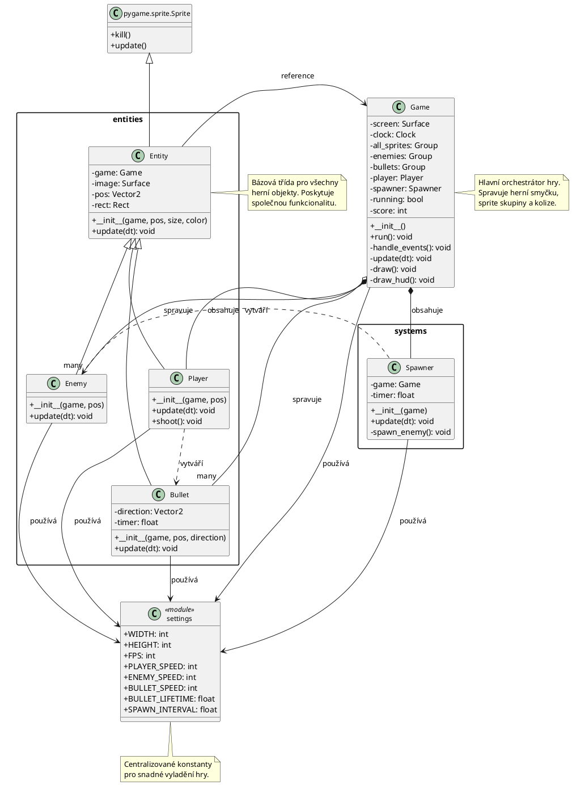

# Arena Survival - Výukový projekt

## 📋 Obsah
1. [Zadání projektu](#zadání-projektu)
2. [Herní mechaniky](#herní-mechaniky)
3. [Technologické požadavky](#technologické-požadavky)
4. [Struktura projektu](#struktura-projektu)
5. [UML diagram tříd](#uml-diagram-tříd)
6. [Detailní rozbor implementace](#detailní-rozbor-implementace)
7. [Spuštění projektu](#spuštění-projektu)
8. [Ovládání](#ovládání)
9. [Důležité koncepty](#důležité-koncepty)

---

## 🎯 Zadání projektu

Vytvořte 2D survival arénovou hru v Pythonu s využitím knihovny Pygame, která demonstruje objektově orientované programování (OOP).

### Funkční požadavky:
- ✅ Hráč ovládaný klávesnicí (WASD)
- ✅ Střelba směrem k myši
- ✅ Automatické spawování nepřátel
- ✅ Systém kolizí (projektily × nepřátelé, hráč × nepřátelé)
- ✅ Sledování skóre
- ✅ Omezení pohybu hráče uvnitř herní plochy
- ✅ Objektově orientovaná architektura

### Nefunkční požadavky:
- ✅ Čitelný a dobře strukturovaný kód
- ✅ Kompletní dokumentace všech tříd a metod
- ✅ Oddělení herní logiky od konfigurace
- ✅ Použití sprite skupin pro efektivní správu objektů

---

## 🎮 Herní mechaniky

### Základní herní smyčka
Hra běží na principu **game loop** s pevným FPS (60 snímků/s):
1. **Input handling** - zpracování vstupů od uživatele
2. **Update** - aktualizace stavu hry (pohyb, kolize)
3. **Render** - vykreslení na obrazovku

### Herní objekty

| Objekt | Velikost | Barva | Chování |
|--------|----------|-------|---------|
| **Hráč** | 40×40 px | Modrá (50, 200, 255) | Ovládán WASD, střílí na klik |
| **Nepřítel** | 30×30 px | Červená (255, 60, 60) | Pronásleduje hráče |
| **Projektil** | 10×10 px | Žlutá (255, 255, 0) | Letí přímočaře, životnost 1.5s |

### Systémy
- **Spawner** - Každé 2 sekundy vytvoří nepřítele na náhodném okraji obrazovky
- **Collision Detection** - Detekce kolizí pomocí pygame.sprite.spritecollide()
- **Score System** - Body za každého zničeného nepřítele
- **Movement Constraint** - Hráč nemůže opustit herní plochu

---

## 💻 Technologické požadavky

### Závislosti
```
Python 3.7+
pygame 2.0+
```

### Instalace pygame
```bash
pip install pygame
```

---

## 📁 Struktura projektu

```
arena_game/
│
├── main.py                 # Vstupní bod aplikace
├── game.py                 # Hlavní herní třída
├── settings.py             # Konfigurace a konstanty
├── README.md               # Dokumentace projektu
│
├── entities/               # Herní entity
│   ├── __init__.py
│   ├── entity.py          # Bázová třída pro všechny entity
│   ├── player.py          # Třída hráče
│   ├── enemy.py           # Třída nepřítele
│   └── bullet.py          # Třída projektilu
│
└── systems/                # Herní systémy
    ├── __init__.py
    └── spawner.py         # Systém pro spawn nepřátel
```

### Popis souborů

#### **main.py**
Vstupní bod aplikace. Inicializuje pygame a spouští hlavní herní smyčku.

#### **game.py**
Centrální třída, která orchestruje celou hru:
- Správa sprite skupin
- Herní smyčka (input → update → render)
- Detekce kolizí
- Vykreslování HUD

#### **settings.py**
Obsahuje všechny herní konstanty (rozměry okna, rychlosti, intervaly).
Umožňuje snadné vyladění hry bez úpravy kódu.

#### **entities/**
Balíček s herními entitami. Všechny dědí z bázové třídy `Entity`.

#### **systems/**
Balíček s herními systémy, které nejsou přímo entity (např. spawner).

---

## 📊 UML diagram tříd



### Vysvětlení diagramu

#### Hierarchie dědičnosti
```
pygame.sprite.Sprite
    └── Entity (bázová třída)
        ├── Player
        ├── Enemy
        └── Bullet
```

#### Vztahy mezi třídami

**Dědičnost (inheritance)** `<|--`
- Všechny herní entity dědí z `Entity`
- `Entity` dědí z `pygame.sprite.Sprite`

**Kompozice (composition)** `*--`
- `Game` vlastní `Player` a `Spawner`
- Bez Game tyto objekty nemají smysl

**Agregace (aggregation)** `o--`
- `Game` spravuje kolekce `Enemy` a `Bullet`
- Tyto objekty mohou existovat nezávisle

**Závislost (dependency)** `..>`
- `Player` vytváří `Bullet` objekty
- `Spawner` vytváří `Enemy` objekty
- Všechny třídy používají konstanty ze `settings`

**Asociace (association)** `-->`
- Všechny `Entity` mají referenci na `Game`

---

## 🔍 Detailní rozbor implementace

### 1. Bázová třída Entity

```python
class Entity(pygame.sprite.Sprite):
    def __init__(self, game, pos, size, color):
        super().__init__()
        self.game = game
        self.image = pygame.Surface(size)
        self.image.fill(color)
        self.pos = pygame.Vector2(pos)
        self.rect = self.image.get_rect(center=pos)
```

**Klíčové koncepty:**
- **Dědičnost z pygame.sprite.Sprite** - umožňuje použití sprite skupin
- **Surface** - každá entita má svůj obrázek (zde jednobarevný čtverec)
- **Vector2** - přesná pozice s desetinnými čísly pro plynulý pohyb
- **Rect** - obdélník pro kolize a vykreslování
- **Reference na Game** - všechny entity znají herní kontext

### 2. Třída Player - Pohyb a střelba

#### Pohyb s normalizací
```python
vel = pygame.Vector2(0, 0)
if keys[pygame.K_w]: vel.y = -1
if keys[pygame.K_s]: vel.y = 1
if keys[pygame.K_a]: vel.x = -1
if keys[pygame.K_d]: vel.x = 1

if vel.length() > 0:
    vel = vel.normalize() * PLAYER_SPEED
```

**Proč normalizace?**
- Bez normalizace: diagonální pohyb je √2× rychlejší
- S normalizací: všechny směry stejně rychlé
- `normalize()` vytvoří jednotkový vektor (délka = 1)

#### Omezení pohybu (clamping)
```python
half_width = self.rect.width / 2
half_height = self.rect.height / 2

self.pos.x = max(half_width, min(self.pos.x, WIDTH - half_width))
self.pos.y = max(half_height, min(self.pos.y, HEIGHT - half_height))
```

**Princip:**
- `max(half_width, ...)` - zajistí minimální hodnotu
- `min(..., WIDTH - half_width)` - zajistí maximální hodnotu
- Výsledek: hráč "přilne" k okraji, nemůže ho překročit

#### Střelba směrem k myši
```python
mouse_pos = pygame.Vector2(pygame.mouse.get_pos())
direction = mouse_pos - self.pos

if direction.length() > 0:
    direction = direction.normalize()

bullet = Bullet(self.game, self.pos, direction)
```

**Výpočet směru:**
1. Získej pozici myši
2. Odečti pozici hráče → směrový vektor
3. Normalizuj → jednotkový vektor
4. Předej projektilu

### 3. Třída Enemy - AI pronásledování

```python
direction = (self.game.player.pos - self.pos)
if direction.length() > 0:
    direction = direction.normalize()
self.pos += direction * ENEMY_SPEED * dt
```

**Jednoduchá AI:**
- Vypočítej vektor k hráči
- Normalizuj (konstantní rychlost)
- Pohybuj se tímto směrem
- Výsledek: nepřítel vždy jde nejkratší cestou k hráči

### 4. Třída Bullet - Časovaný život

```python
self.timer += dt
if self.timer >= BULLET_LIFETIME:
    self.kill()
```

**Automatické odstranění:**
- `kill()` - odstraní sprite ze všech skupin
- Předchází přeplnění paměti
- Projektily "zmizí" po 1.5 sekundě

### 5. Třída Spawner - Náhodné generování

```python
side = random.choice(["top", "bottom", "left", "right"])

if side == "top":
    pos = (random.randint(0, WIDTH), 0)
elif side == "bottom":
    pos = (random.randint(0, WIDTH), HEIGHT)
# ...
```

**Strategie spawnu:**
- Náhodný výběr strany obrazovky
- Náhodná pozice na vybrané straně
- Nepřátelé přicházejí ze všech směrů
- Zajišťuje nepředvídatelnost

### 6. Třída Game - Správa kolizí

#### Kolize projektilů s nepřáteli
```python
for bullet in self.bullets:
    hits = pygame.sprite.spritecollide(bullet, self.enemies, True)
    if hits:
        bullet.kill()
        self.score += len(hits)
```

**Parametry spritecollide:**
- `bullet` - testovaný sprite
- `self.enemies` - skupina pro test
- `True` - automaticky odstranit zasažené nepřátele
- Vrací seznam zasažených sprite objektů

#### Kolize hráče s nepřáteli (Game Over)
```python
if pygame.sprite.spritecollide(self.player, self.enemies, False):
    self.running = False
```

**Rozdíl:**
- `False` - NEodstraňovat nepřátele
- Stačí jeden kontakt → konec hry

### 7. Delta Time - Framerate nezávislý pohyb

```python
dt = self.clock.tick(FPS) / 1000  # dt v sekundách
self.pos += vel * dt
```

**Proč delta time?**
- Bez dt: pohyb závisí na FPS (60 FPS ≠ 30 FPS)
- S dt: stejná rychlost bez ohledu na FPS
- `dt` = čas od posledního snímku v sekundách

**Příklad:**
```
PLAYER_SPEED = 250  # pixelů za sekundu
dt = 0.016          # ~60 FPS
pohyb = 250 * 0.016 = 4 pixely za snímek
```

---

## 🚀 Spuštění projektu

### Metoda 1: Přímo z příkazové řádky
```bash
cd arena_game
python main.py
```

### Metoda 2: PowerShell
```powershell
cd arena_game
py .\main.py
```

### Metoda 3: Z editoru
Otevřete `main.py` a spusťte (F5 ve většině IDE).

---

## 🎮 Ovládání

| Akce | Ovládání |
|------|----------|
| **Pohyb nahoru** | W |
| **Pohyb doleva** | A |
| **Pohyb dolů** | S |
| **Pohyb doprava** | D |
| **Zaměření** | Pohyb myši |
| **Střelba** | Levé tlačítko myši |
| **Ukončení** | Křížek okna / Dotek nepřítele |

---

## 💡 Důležité koncepty

### Objektově orientované programování (OOP)

#### 1. Dědičnost (Inheritance)
```python
class Player(Entity):  # Player dědí z Entity
```
- Sdílení kódu mezi příbuznými třídami
- `super().__init__()` volá konstruktor rodiče

#### 2. Zapouzdření (Encapsulation)
```python
class Entity:
    def __init__(self, game, pos, size, color):
        self.game = game      # Veřejný atribut
        self.pos = Vector2()  # Veřejný atribut
```
- Data a metody seskupeny do tříd
- V Pythonu konvence: `_private`, `public`

#### 3. Polymorfismus (Polymorphism)
```python
self.all_sprites.update(dt)  # Každá entita má svou update()
```
- Stejné rozhraní, různé implementace
- `Player.update()` ≠ `Enemy.update()` ≠ `Bullet.update()`

### Pygame specifické koncepty

#### Sprite skupiny
```python
self.all_sprites = pygame.sprite.Group()
self.enemies = pygame.sprite.Group()
self.bullets = pygame.sprite.Group()
```

**Výhody:**
- Automatické volání `update()` na všech členech
- Automatické volání `draw()` na všech členech
- Efektivní kolizní detekce
- Snadná správa objektů

#### Surface a Rect
```python
self.image = pygame.Surface((40, 40))  # Vykreslitelný obrázek
self.rect = self.image.get_rect()      # Obdélník pro pozici/kolize
```

**Surface:**
- Reprezentuje obrázek/texturu
- Může být vykreslena na jinou Surface

**Rect:**
- Obdélník s pozicí a rozměry
- Používá se pro kolize a umístění

### Herní programování

#### Herní smyčka (Game Loop)
```
while running:
    handle_input()
    update()
    render()
```

**Tři fáze:**
1. **Input** - Co hráč chce dělat?
2. **Update** - Jak se mění svět?
3. **Render** - Co hráč vidí?

#### Separace logiky a prezentace
```
settings.py      → Konfigurace
entities/        → Herní logika
game.py          → Orchestrace
main.py          → Vstupní bod
```

**Výhody:**
- Snadné ladění parametrů
- Přehledná struktura
- Znovupoužitelný kód

---

## 🎓 Vzdělávací cíle

Po prostudování tohoto projektu byste měli rozumět:

1. **OOP principům** - dědičnost, zapouzdření, polymorfismus
2. **Herní smyčce** - input → update → render
3. **Sprite systému** - správa herních objektů
4. **Vektorové matematice** - směry, normalizace, vzdálenosti
5. **Kolizím** - detekce a zpracování
6. **Delta time** - framerate nezávislý pohyb
7. **Struktuře projektu** - separace concerns

---

## 🔧 Možná vylepšení

Projekt lze rozšířit o:

- 🎵 **Zvuky** - střelba, exploze, hudba
- 🖼️ **Grafiku** - sprite sheety místo barevných čtverců
- 💥 **Částicové efekty** - exploze při zásahu
- 🏆 **High score** - ukládání nejlepšího skóre
- ⚡ **Power-upy** - zrychlení, více životů
- 🎯 **Různé typy nepřátel** - rychlí, pomalí, tanky
- 🛡️ **Životy hráče** - více pokusů před game over
- 📊 **Obtížnost** - postupné zrychlování spawnu
- 🌈 **Menu** - start screen, pause, game over
- 🎨 **Animace** - pohybující se sprite sheety

---

## 📚 Další studium

### Doporučené zdroje:
- [Pygame dokumentace](https://www.pygame.org/docs/)
- [Real Python - Pygame tutoriál](https://realpython.com/pygame-a-primer/)
- [Game Programming Patterns](https://gameprogrammingpatterns.com/)
- [PlantUML dokumentace](https://plantuml.com/)

### Související koncepty:
- **Component-Entity System (ECS)** - alternativní architektura
- **State machines** - správa herních stavů
- **Pathfinding** - A* algoritmus pro inteligentní pohyb
- **Spatial hashing** - optimalizace kolizí pro velké množství objektů

---

## 👨‍💻 Autor a licence

Tento projekt byl vytvořen jako výukový materiál pro demonstraci objektově orientovaného programování v Pythonu s použitím knihovny Pygame.

**Datum vytvoření:** 25. listopadu 2025

**Použité technologie:**
- Python 3.x
- Pygame 2.x
- PlantUML (pro diagramy)

---

## 📝 Poznámky k implementaci

### Proč Entity jako bázová třída?
- **DRY princip** (Don't Repeat Yourself)
- Všechny herní objekty mají společné vlastnosti
- Snadné přidání nových typů entit

### Proč separátní settings.py?
- **Single Source of Truth** - jedna hodnota na jednom místě
- Snadné vyladění hry bez zásahu do kódu
- Možnost načítání z konfiguračního souboru

### Proč Vector2 místo tuple?
- Matematické operace (`+`, `-`, `*`, `/`)
- Metody jako `normalize()`, `length()`, `distance_to()`
- Přesnější pohyb s float hodnotami

### Proč delta time?
- **Framerate independence** - hra běží stejně na každém PC
- Profesionální standard v herním vývoji
- Umožňuje dynamické FPS (VSync, variable refresh rate)

---

**Happy coding! 🎮✨**
